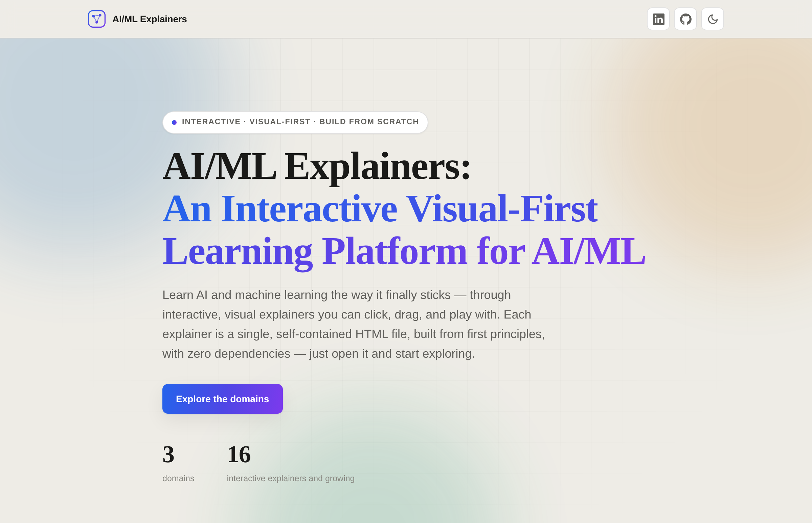

  

<h1 align="center">AI/ML Explainers</h1>

<em>An Interactive Visual-First Learning Platform for AI/ML</em>

  <a href="https://ancilcleetus.github.io/AI-ML-Explainers/"><strong>Browse all explainers on the live site &rarr;</strong></a>

---

Learn AI and machine learning the way it finally sticks — through interactive, visual explainers you can click, drag, and play with. Built for engineers who want to go deep, not skim the surface: no prior AI background assumed, just code literacy and curiosity.

Each explainer is a single, self-contained HTML file, built from first principles, with zero dependencies — just open it and start exploring.

## What makes it different

- **Visual-first.** Every concept is something you see and manipulate, not a wall of text.
- **Interactive.** Click buttons, drag sliders, and step through animations until each idea clicks and stays.
- **Optional build-from-scratch content.** Many explainers include advanced companion material — Jupyter notebooks or full end-to-end projects — for readers who want to build everything themselves.

## Domains &amp; roadmaps

Each domain has a roadmap tracking what is planned and what is already live:

- **Deep Learning** — [roadmap](https://ancilcleetus.github.io/AI-ML-Explainers/Deep-Learning/Deep-Learning-Explainer-Roadmap.html)
- **Computer Vision** — [roadmap](https://ancilcleetus.github.io/AI-ML-Explainers/Computer-Vision/Computer-Vision-Explainer-Roadmap.html)
- **Generative AI** — [live on the site](https://ancilcleetus.github.io/AI-ML-Explainers/#domains) (roadmap coming soon)

> The full, always-up-to-date list of published explainers lives on the **[live site](https://ancilcleetus.github.io/AI-ML-Explainers/)** — that is the canonical catalog. This README intentionally stays a short signpost, so it never goes stale as more explainers are added.

## Tech

Pure HTML, CSS, and vanilla JavaScript — no frameworks, no build step, no external dependencies. Every explainer works offline simply by opening the file in a browser. The site is published with GitHub Pages.

---

  Built with &hearts; by <a href="https://www.linkedin.com/in/ancilcleetus/">Ancil Cleetus</a> &middot; No External Dependencies &middot; MIT License

